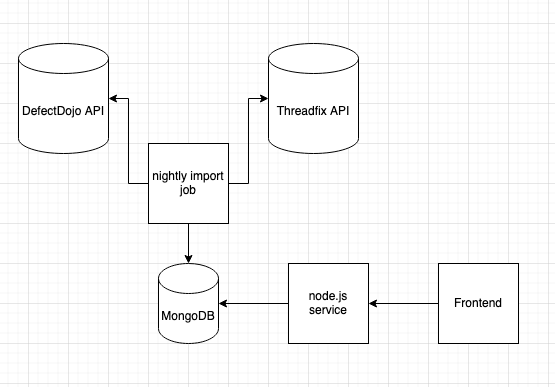

# Vulnerability Heatmap

[](https://github.com/secureIO-GmbH/VulnerabilityHeatmap/actions/workflows/node.js.yml) [](https://github.com/secureIO-GmbH/VulnerabilityHeatmap/actions/workflows/trivy.yml) [](https://github.com/secureIO-GmbH/VulnerabilityHeatmap/actions/workflows/github-code-scanning/codeql)

Visualizes security vulnerabilities across multiple projects in heatmap representation.
The orchestration and tracking has become quite complex, especially for central security teams in large enterprises dealing with a multitude of distributed teams. The heatmap is built for the ease of adaption by technology management and development roles to identify the critical outliers within the organization. The different views of the heatmap allow tailored representation of configurable criteria over time and across projects.
The Vulnerability Heatmap is particular helpful for Security Awareness and Security Champions programs by giving an easy consumable representations of the enterprise's flaws. Best-practice guidance for incorporation in your Awareness program will be referenced in the future.

## Demo

See here: [https://secureio-gmbh.github.io/VulnerabilityHeatmap/](https://secureio-gmbh.github.io/VulnerabilityHeatmap/)

## Development

Create a file called `backend/config.js` with the following content:

```
echo "
export const THREADFIX_APIKEY  = '$THREADFIX_APIKEY';
export const THREADFIX_BASEURL = '$THREADFIX_BASEURL';
export const KIUWAN_API_KEY    = "$KIUWAN_API_KEY";
export const DD_APIKEY         = '$DD_APIKEY';
export const DD_BASEURL        = '$DD_BASEURL';
" > backend/config.js
```

Get the values of `$THREADFIX_APIKEY` and `$THREADFIX_BASEURL` etc. from your running Threadfix/DefectDojo instance.

Start DB:

```
$ docker run --name heatmap_db  -d mongo:latest
$ docker exec -it  heatmap_db mongosh
> use heatmap
> db.apps.find()
```

Then start the node.js server and serve the index.html file:

```
# Start the node.js server
$ npm install
$ PORT=9878 HTTPS_PORT=9879 NODE_ENV=production node backend/server.js
```

## Install via Docker

```
$ docker build -t heatmap .
$ docker run -p 9877:9877 -d heatmap

# get a shell inside
$ docker run -it --entrypoint /bin/sh heatmap

# run on the server directly
PORT=9877 NODE_ENV=production node backend/server.js
```

## Deploy to GitHub pages

```
npm run deploy
```

## Architecture

A nightly import job fetches data from the DefectDojo (Or Threadfix) API, normalizes it to a unified data structure and stores it into a MongoDB. When the frontend wants to display the data, a simple node.js service is then able to fetch the data fast from MongoDB in order to support realtime visualization.


